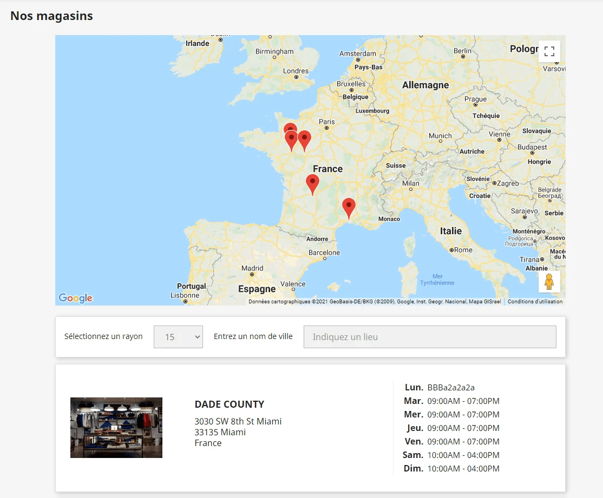
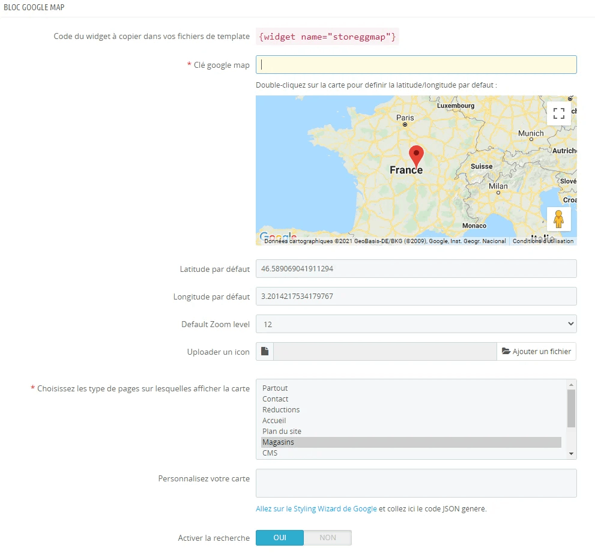

<h1>⚠️ Module en fin de vie — non maintenu / End of life — unmaintained</h1>

<strong>Ce module n'est plus maintenu depuis août 2026.</strong>
La dernière version publiée est la <strong>2.1.1</strong>, compatible
<strong>PrestaShop 1.7 à 8.x uniquement</strong>. Il n'est pas compatible
PrestaShop 9 et ne le sera pas : à partir de la 2.1.1, le module refuse
lui-même de s'installer sur PrestaShop 9.

Aucun correctif de bug, aucune mise à jour de compatibilité et
<strong>aucun correctif de sécurité</strong> ne sera publié. Les issues et
les pull requests ne sont plus traitées.

Le code reste disponible sous licence AFL-3.0 : vous êtes libre de le forker
et de le reprendre à votre compte.

<em>
This module is no longer maintained as of August 2026. The last released
version is 2.1.1, supporting PrestaShop 1.7 to 8.x only — it is not, and will
not become, PrestaShop 9 compatible. No bug fixes, no compatibility updates
and no security fixes will be published; issues and pull requests are no
longer handled. The code stays available under the AFL-3.0 license, so you are
free to fork it.
</em>

<h1>Show your store list on a google map - for PrestaShop 1.7 and higher</h1>
<h2>About</h2>

Display a google map block fill with your store list.

Front Office view

Back Office view

<h3>Installation</h3>
<ol>
<li>Download the module zip from latest releases</li>
<li>Upload and install it from your Back Office</li>
<li>Fill the Google Map API key input</li>
<li>Choose pages to show the google map</li>
<li>Paste this code : <strong>{widget name="storeggmap"}</strong> in your themes/{yourtheme}/templates/cms/stores.tpl or another template file in relation with page selector</li>
</ol>

You can customize store info html by editing views/templates/front/storeggmap_detail.tpl

<h3>Google API key</h3>

The key must allow the <strong>Maps JavaScript API</strong>, and the
<strong>Places API</strong> if you enable the search box. Geocoding is done
from the browser, so an HTTP referrer restriction on the key is enough — a
server-side key restriction is not required.

